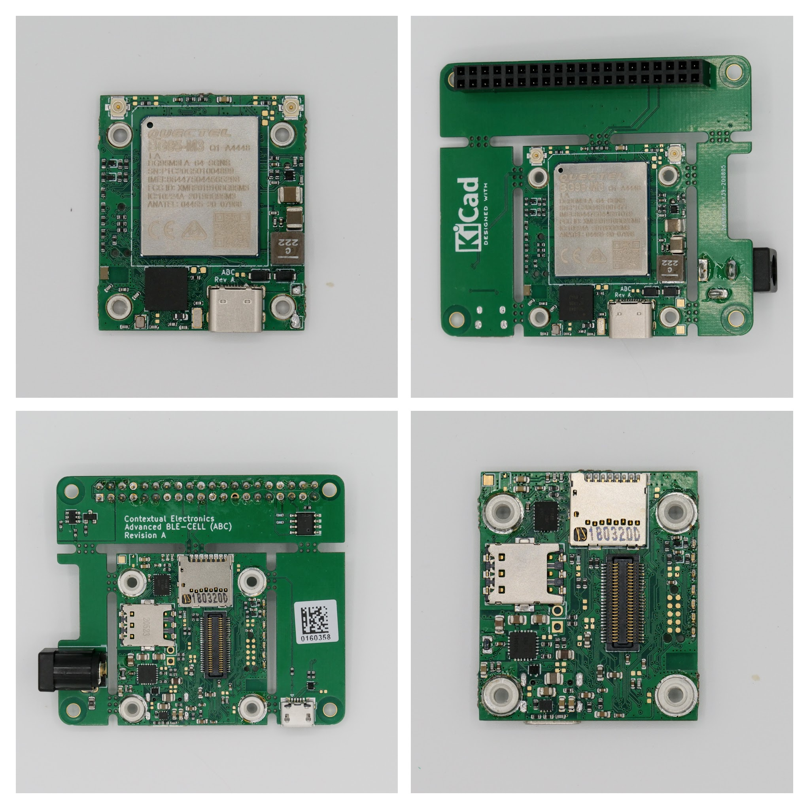

.. _contextualelectronics_abc:

Contextual Eletronics Advanced BLE Cell
#######################################

Overview
********

The Contextual Eletronics ABC (PCA10056) hardware provides support for the
Nordic Semiconductor nRF52840 ARM Cortex-M4F CPU and the following devices:

* CLOCK
* FLASH
* :abbr:`GPIO (General Purpose Input Output)`
* :abbr:`I2C (Inter-Integrated Circuit)`
* :abbr:`MPU (Memory Protection Unit)`
* :abbr:`NVIC (Nested Vectored Interrupt Controller)`
* :abbr:`PWM (Pulse Width Modulation)`
* Segger RTT (RTT Console)
* :abbr:`SPI (Serial Peripheral Interface)`
* :abbr:`UART (Universal asynchronous receiver-transmitter)`
* Quectel BG95 Modem

     Contextual Electronics Advanced BLE Cell (Credit: Chris Gamell)

More information about the board can be found at the `ABC Board website`_.
The `Nordic Semiconductor Infocenter`_ contains the processor's information
and the datasheet.

Hardware
********

ABC board has two external oscillators. The frequency of the slow clock
is 32.768 kHz. The frequency of the main clock is 32 MHz.

Supported Features
==================

The contextualelectronics_abc board configuration supports the following
hardware features:

+-----------+------------+----------------------+
| Interface | Controller | Driver/Component     |
+===========+============+======================+
| CLOCK     | on-chip    | clock_control        |
+-----------+------------+----------------------+
| FLASH     | on-chip    | flash                |
+-----------+------------+----------------------+
| GPIO      | on-chip    | gpio                 |
+-----------+------------+----------------------+
| I2C(M)    | on-chip    | i2c                  |
+-----------+------------+----------------------+
| MPU       | on-chip    | arch/arm             |
+-----------+------------+----------------------+
| NVIC      | on-chip    | arch/arm             |
+-----------+------------+----------------------+
| PWM       | on-chip    | pwm                  |
+-----------+------------+----------------------+
| RTC       | on-chip    | system clock         |
+-----------+------------+----------------------+
| RTT       | Segger     | console              |
+-----------+------------+----------------------+
| SPI(M)    | on-chip    | spi                  |
+-----------+------------+----------------------+
| UART      | on-chip    | serial               |
+-----------+------------+----------------------+
| Modem     | on-board   | quectel_bg9x         |
+-----------+------------+----------------------+

Other hardware features are not supported by the Zephyr kernel.
See `ABC Board website`_ for more details on this board, and
`Nordic Semiconductor Infocenter`_ for a complete list of SoC
features.

Programming and Debugging
*************************

Applications for the ``contextualelectronics_abc`` board configuration can be
built and flashed in the usual way (see :ref:`build_an_application`
and :ref:`application_run` for more details); however, the standard
debugging targets are not currently available.

Flashing
========

Follow the instructions in the :ref:`nordic_segger` page to install
and configure all the necessary software. Further information can be
found in :ref:`nordic_segger_flashing`. Then build and flash
applications as usual (see :ref:`build_an_application` and
:ref:`application_run` for more details).

Here is an example for the :ref:`hello_world` application.

First, run your favorite terminal program to listen for output.

.. code-block:: console

   $ minicom -D <tty_device> -b 115200

Replace :code:`<tty_device>` with the port where the ABC board
can be found. For example, under Linux, :code:`/dev/ttyACM0`.

Then build and flash the application in the usual way.

.. zephyr-app-commands::
   :zephyr-app: samples/hello_world
   :board: contextualelectronics_abc
   :goals: build flash

Debugging
=========

Refer to the :ref:`nordic_segger` page to learn about debugging Nordic boards with a
Segger IC.

Overlay file naming
===================

The file has to be named ``<board>.overlay`` and placed in the app main directory to be
picked up automatically by the build system.

Selecting the pins
==================
To select the pin numbers for tx-pin and rx-pin:

.. code-block:: console

   tx-pin = <pin_no>

Open the `nRF52840 Product Specification`_, chapter 7 'Hardware and Layout'.
In the table 7.1.1 'aQFN73 ball assignments' select the pins marked
'General purpose I/O'.  Note that pins marked as 'low frequency I/O only' can only be used
in under-10KHz applications. They are not suitable for 115200 speed of UART.

Translate the 'Pin' into number for devicetree by using the following formula::

   pin_no = b\*32 + a

where ``a`` and ``b`` are from the Pin value in the table (Pb.a).
For example, for P0.1, ``pin_no = 1`` and for P1.0, ``pin_no = 32``.

References
**********

.. target-notes::

.. _ABC Board website: https://contextualelectronics.com/courses/advanced-ble-cell-abc-board/
.. _Nordic Semiconductor Infocenter: https://infocenter.nordicsemi.com
.. _J-Link Software and documentation pack: https://www.segger.com/jlink-software.html
.. _nRF52840 Product Specification: http://infocenter.nordicsemi.com/pdf/nRF52840_PS_v1.0.pdf
